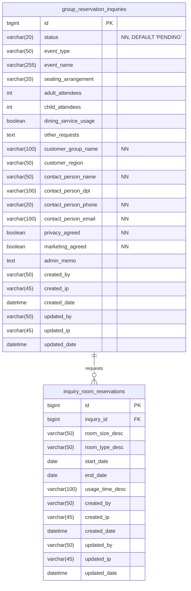

# 회의실 단체 예약 문의 기능 명세

> 본 문서는 회의실 단체 예약 문의 기능의 데이터베이스 구조와 관리자 페이지 요구 기능을 정의합니다.

## 1. 개요

- 본 기능은 웹사이트 방문자가 **로그인 없이** 단체 시설 이용에 대한 문의를 등록하는 것을 목표로 합니다.
- 사용자는 **여러 개의 세미나실을 선택**할 수 있으며, **각각의 선택된 세미나실에 대해 여러 개의 이용 날짜와 시간대를 지정**할 수 있습니다.
- 관리자는 관리자 페이지를 통해 접수된 문의를 확인하고 상태를 변경하며, 고객 응대에 필요한 내부 정보를 기록할 수 있습니다.

## 2. 데이터베이스 설계

- 문의의 기본 정보를 담는 **`group_reservation_inquiries`** 테이블과, 각 문의에 종속되어 요청된 세미나실과 시간 정보를 담는 **`inquiry_room_reservations`** 테이블, 총 2개의 테이블로 스키마를 설계합니다.
- 이 구조는 사용자가 하나의 문의에 여러 개의 '세미나실-시간' 조합을 요청하는 시나리오를 지원합니다.
- 모든 테이블에는 생성 및 수정 기록을 추적하기 위한 감사 로그 컬럼을 포함합니다.

---

### 2.1. 테이블 상세 명세

#### 가. `group_reservation_inquiries` - 문의 기본 정보 (메인)

| 컬럼명                 | 데이터 타입    | 제약조건          | 설명                                         |
| :--------------------- | :------------- | :---------------- | :------------------------------------------- |
| `id`                   | `BIGINT`       | PK, AI            | 고유 식별자                                  |
| `status`               | `VARCHAR(20)`  | NN, DEF 'PENDING' | 문의 상태 (예: PENDING, CONFIRMED, CANCELED) |
| `event_type`           | `VARCHAR(50)`  |                   | 행사 구분 (예: 세미나, 워크숍)               |
| `event_name`           | `VARCHAR(255)` |                   | 행사명                                       |
| `seating_arrangement`  | `VARCHAR(20)`  |                   | 좌석 배치 방식 (예: 강의식, 극장식)          |
| `adult_attendees`      | `INT`          |                   | 성인 인원수                                  |
| `child_attendees`      | `INT`          |                   | 소인 인원수                                  |
| `dining_service_usage` | `BOOLEAN`      |                   | 식당 사용 여부                               |
| `other_requests`       | `TEXT`         |                   | 기타 문의 사항                               |
| `customer_group_name`  | `VARCHAR(100)` | NN                | 고객 단체명                                  |
| `customer_region`      | `VARCHAR(50)`  |                   | 고객 소속 지역                               |
| `contact_person_name`  | `VARCHAR(50)`  | NN                | 담당자 이름                                  |
| `contact_person_dpt`   | `VARCHAR(100)` |                   | 담당자 부서 및 직위                          |
| `contact_person_phone` | `VARCHAR(20)`  | NN                | 담당자 연락처                                |
| `contact_person_email` | `VARCHAR(100)` | NN                | 담당자 이메일                                |
| `privacy_agreed`       | `BOOLEAN`      | NN                | 개인정보 수집 동의 여부                      |
| `marketing_agreed`     | `BOOLEAN`      | NN                | 마케팅 정보 수신 동의 여부                   |
| `admin_memo`           | `TEXT`         |                   | 관리자용 내부 메모                           |
| `created_by`           | `VARCHAR(50)`  |                   | 등록자 (관리자 ID 또는 'GUEST')              |
| `created_ip`           | `VARCHAR(45)`  |                   | 등록 IP 주소                                 |
| `created_date`         | `DATETIME`     |                   | 문의 등록일                                  |
| `updated_by`           | `VARCHAR(50)`  |                   | 최종 수정 관리자 ID                          |
| `updated_ip`           | `VARCHAR(45)`  |                   | 최종 수정 IP 주소                            |
| `updated_date`         | `DATETIME`     |                   | 정보 수정일                                  |

_PK: Primary Key, AI: Auto Increment, NN: Not Null, DEF: Default_

#### 나. `inquiry_room_reservations` - 요청 세미나실 및 시간 정보

| 컬럼명            | 데이터 타입    | 제약조건 | 설명                                             |
| :---------------- | :------------- | :------- | :----------------------------------------------- |
| `id`              | `BIGINT`       | PK, AI   | 고유 식별자                                      |
| `inquiry_id`      | `BIGINT`       | FK, NN   | `group_reservation_inquiries.id` 참조            |
| `room_size_desc`  | `VARCHAR(50)`  |          | 세미나실 분류 (예: 대회의실, 중회의실, 소회의실) |
| `room_type_desc`  | `VARCHAR(50)`  |          | 세미나실 이름 (예: 시걸, 클로버, 가람)           |
| `start_date`      | `DATE`         |          | 행사 시작일                                      |
| `end_date`        | `DATE`         |          | 행사 종료일                                      |
| `usage_time_desc` | `VARCHAR(100)` |          | 사용 시간 설명 (예: 09:00 - 12:00)               |
| `created_by`      | `VARCHAR(50)`  |          | 등록자 (관리자 ID 또는 'GUEST')                  |
| `created_ip`      | `VARCHAR(45)`  |          | 등록 IP 주소                                     |
| `created_date`    | `DATETIME`     |          | 등록일                                           |
| `updated_by`      | `VARCHAR(50)`  |          | 최종 수정 관리자 ID                              |
| `updated_ip`      | `VARCHAR(45)`  |          | 최종 수정 IP 주소                                |
| `updated_date`    | `DATETIME`     |          | 정보 수정일                                      |

---

### 2.2. 테이블 관계도 (ERD)



---

### 2.3. 데이터 정의어 (DDL)

```sql
-- DDL for Group Reservation Inquiry Feature

-- 1. 문의 기본 정보 테이블
CREATE TABLE `group_reservation_inquiries` (
  `id` BIGINT NOT NULL AUTO_INCREMENT,
  `status` VARCHAR(20) NOT NULL DEFAULT 'PENDING' COMMENT '문의 상태 (PENDING, CONFIRMED, CANCELED)',
  `event_type` VARCHAR(50) NULL COMMENT '행사 구분',
  `event_name` VARCHAR(255) NULL COMMENT '행사명',
  `seating_arrangement` VARCHAR(20) NULL COMMENT '좌석 배치 방식',
  `adult_attendees` INT NULL COMMENT '성인 인원수',
  `child_attendees` INT NULL COMMENT '소인 인원수',
  `dining_service_usage` BOOLEAN NULL COMMENT '식당 사용 여부',
  `other_requests` TEXT NULL COMMENT '기타 문의 사항',
  `customer_group_name` VARCHAR(100) NOT NULL COMMENT '고객 단체명',
  `customer_region` VARCHAR(50) NULL COMMENT '고객 소속 지역',
  `contact_person_name` VARCHAR(50) NOT NULL COMMENT '담당자 이름',
  `contact_person_dpt` VARCHAR(100) NULL COMMENT '담당자 부서 및 직위',
  `contact_person_phone` VARCHAR(20) NOT NULL COMMENT '담당자 연락처',
  `contact_person_email` VARCHAR(100) NOT NULL COMMENT '담당자 이메일',
  `privacy_agreed` BOOLEAN NOT NULL COMMENT '개인정보 수집 동의 여부',
  `marketing_agreed` BOOLEAN NOT NULL COMMENT '마케팅 정보 수신 동의 여부',
  `admin_memo` TEXT NULL COMMENT '관리자용 내부 메모',
  `created_by` VARCHAR(50) NULL COMMENT '등록자 (관리자 ID 또는 GUEST)',
  `created_ip` VARCHAR(45) NULL COMMENT '등록 IP 주소',
  `created_date` DATETIME NOT NULL DEFAULT CURRENT_TIMESTAMP COMMENT '문의 등록일',
  `updated_by` VARCHAR(50) NULL COMMENT '수정자 (관리자 ID)',
  `updated_ip` VARCHAR(45) NULL COMMENT '수정 IP 주소',
  `updated_date` DATETIME NOT NULL DEFAULT CURRENT_TIMESTAMP ON UPDATE CURRENT_TIMESTAMP COMMENT '정보 수정일',
  PRIMARY KEY (`id`)
) COMMENT='회의실 단체 예약 문의 기본 정보';

-- 2. 요청 세미나실 및 시간 정보 테이블
CREATE TABLE `inquiry_room_reservations` (
  `id` BIGINT NOT NULL AUTO_INCREMENT,
  `inquiry_id` BIGINT NOT NULL COMMENT '문의 ID',
  `room_size_desc` VARCHAR(50) NULL COMMENT '세미나실 분류 (대회의실, 중회의실, 소회의실)',
  `room_type_desc` VARCHAR(50) NULL COMMENT '세미나실 이름 (시걸, 클로버, 가람 등)',
  `start_date` DATE NULL COMMENT '행사 시작일',
  `end_date` DATE NULL COMMENT '행사 종료일',
  `usage_time_desc` VARCHAR(100) NULL COMMENT '사용 시간 설명',
  `created_by` VARCHAR(50) NULL COMMENT '등록자 (관리자 ID 또는 GUEST)',
  `created_ip` VARCHAR(45) NULL COMMENT '등록 IP 주소',
  `created_date` DATETIME NOT NULL DEFAULT CURRENT_TIMESTAMP COMMENT '등록일',
  `updated_by` VARCHAR(50) NULL COMMENT '수정자 (관리자 ID)',
  `updated_ip` VARCHAR(45) NULL COMMENT '수정 IP 주소',
  `updated_date` DATETIME NOT NULL DEFAULT CURRENT_TIMESTAMP ON UPDATE CURRENT_TIMESTAMP COMMENT '정보 수정일',
  PRIMARY KEY (`id`),
  FOREIGN KEY (`inquiry_id`) REFERENCES `group_reservation_inquiries`(`id`) ON DELETE CASCADE
) COMMENT='문의별 요청 세미나실 및 시간 정보';
```

---

### 2.4. 참고: 세미나실 분류

문의 양식에서 사용자가 선택할 수 있는 세미나실의 종류와 분류는 다음과 같습니다.

- **대회의실 (1개)**
  - 대회의실
- **중회의실 (3개)**
  - 시걸
  - 클로버
  - 자스민
- **소회의실 (3개)**
  - 가람
  - 누리
  - 오션

---

## 3. 관리자 페이지 요구 기능

수집된 데이터를 효과적으로 관리하고 고객 응대를 지원하기 위해 다음과 같은 관리자 기능이 요구됩니다.

### 3.1. 문의 목록 (List View)

- **핵심 정보 표시**: 모든 문의를 표 형태로 나열하며, 문의 번호, 상태, 행사명, 단체명, 담당자, 문의일 등 주요 정보를 한눈에 볼 수 있어야 함.
- **검색**: 단체명, 담당자명, 연락처 등 다양한 조건으로 검색 가능해야 함.
- **필터링**: '접수 대기', '상담중', '예약 확정' 등 **문의 상태(`status`)** 별로 필터링 가능해야 함.
- **정렬**: 최신 문의 순, 행사 날짜 순 등 원하는 기준으로 목록 정렬이 가능해야 함.
- **페이지네이션**: 문의 목록이 길어질 경우를 대비한 페이지네이션 기능이 필요함.

### 3.2. 문의 상세 (Detail View)

- **전체 정보 조회**: 목록에서 특정 문의를 클릭 시, 고객이 입력한 모든 정보와 함께, 요청한 **모든 '세미나실-시간' 조합 목록**을 상세히 확인 가능해야 함.
- **상태 변경 기능**: 문의의 현재 상태(예: '접수 대기' -> '상담중')를 변경할 수 있는 UI(버튼, 드롭다운 등)가 필요함.
- **내부 메모 관리**: 관리자 간 인수인계 및 특이사항 공유를 위해 **내부 메모(`admin_memo`)**를 작성하고 수정하는 기능이 필요함.
