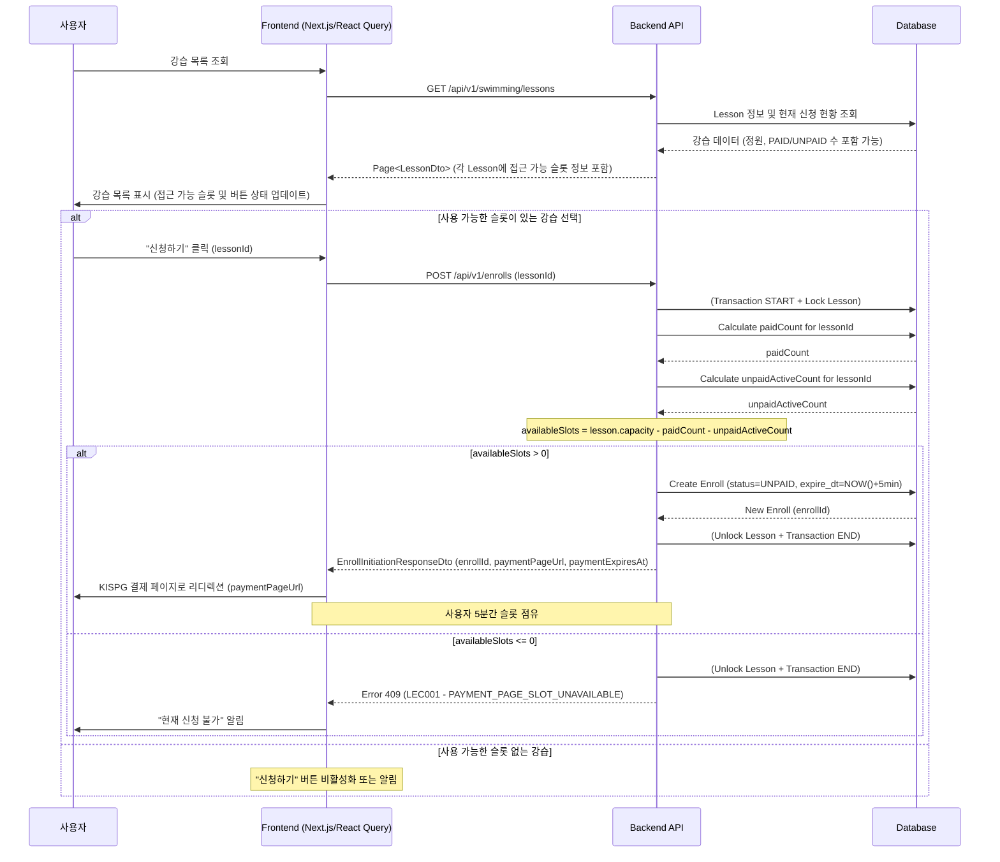

## 📝 강습 신청 정원 관리 및 결제 페이지 접근 제어

**문서 ID:** `Docs/cms/lesson-enrollment-capacity.md`

### 1. 개요

본 문서는 수영 강습 신청 과정에서 정의된 정원을 초과하여 사용자가 결제 페이지에 동시 접근하는 것을 제어하는 시스템의 설계 및 구현 방안을 상세히 기술한다. 목표는 공정한 강습 신청 기회를 보장하고, 시스템 부하를 관리하며, 사용자에게 명확한 피드백을 제공하는 것이다.

**주요 원칙:**

- **결제 페이지 접근은 제한된 자원**: 각 강습별로 동시에 결제 페이지에 머무를 수 있는 사용자 수는 강습의 총 정원에서 이미 결제를 완료한 사용자 수를 제외한 값으로 제한된다.
- **5분 슬롯 점유**: `POST /api/v1/enrolls` 요청에 성공한 사용자는 5분 동안 해당 강습의 결제 페이지 접근 슬롯을 점유한다. 이 시간 내에 결제를 완료하지 못하면 슬롯은 해제된다.
- **실시간 현황 반영**: 사용자에게 제공되는 강습 정보에는 결제 페이지 접근 가능 여부가 최대한 실시간으로 반영되어야 한다.

### 2. 결제 페이지 접근 슬롯 계산 로직

특정 강습에 대해 새로운 사용자가 결제 페이지로 진입할 수 있는지 여부를 판단하는 기준은 다음과 같다:

**`결제 페이지 진입 가능 여부`** = `(해당 강습의 총 정원)` - `(해당 강습에 대해 'PAID' 상태인 신청 건수)` - `(해당 강습에 대해 'UNPAID' 상태이면서 'expire_dt'가 현재 시각 이후인 신청 건수)`

이 계산 결과가 `0`보다 커야 신규 사용자가 결제 페이지로 진입할 수 있다.

- **총 정원**: `lesson.capacity`
- **'PAID' 상태 신청 건수**: 해당 강습에 대해 이미 결제를 완료하고 확정된 신청.
- **'UNPAID' 상태 (만료 전) 신청 건수**: 현재 다른 사용자가 결제 페이지에 진입하여 5분간 슬롯을 점유하고 있는 신청.

결제가 취소되거나(`CANCELED_UNPAID`, `CANCELED_PAID` 후 환불 처리 등), `UNPAID` 상태의 신청이 `PAYMENT_TIMEOUT`으로 변경되면, 해당 슬롯은 다시 사용 가능하게 된다.

### 3. 백엔드 구현

#### 3.1. `EnrollmentServiceImpl` (또는 `POST /api/v1/enrolls` 처리 서비스)

`createInitialEnrollment` (또는 유사 메소드) 로직 수정:

1.  **요청 접수**: `lessonId`를 포함한 요청 수신.
2.  **강습 정보 조회**: `lessonRepository.findById(lessonId)`로 강습 정보 조회.
3.  **동시성 제어 시작**:
    - **방법 1 (Pessimistic Locking)**: `lesson` 엔티티 또는 관련 `LessonCapacity` 집계 엔티티에 대해 비관적 쓰기 잠금 (`LockModeType.PESSIMISTIC_WRITE`)을 획득한다. 이는 강습의 정원 관련 정보를 읽고 업데이트하는 동안 다른 트랜잭션의 동시 접근을 막아 데이터 정합성을 보장한다.
      ```java
      // 예시: Lesson 엔티티 직접 잠금
      Lesson lesson = lessonRepository.findByIdWithLock(lessonId, LockModeType.PESSIMISTIC_WRITE)
          .orElseThrow(() -> new ResourceNotFoundException("Lesson not found", ErrorCode.LESSON_NOT_FOUND));
      ```
    - **방법 2 (분산락 또는 Redis 활용)**: MSA 환경이거나 DB 부하를 더 줄여야 한다면, Redisson 등을 사용한 분산락을 `lessonId` 기준으로 획득하는 것을 고려할 수 있다.
4.  **결제 페이지 접근 슬롯 계산**:
    ```java
    long paidCount = enrollRepository.countByLessonAndPayStatus(lesson, "PAID");
    long unpaidActiveCount = enrollRepository.countByLessonAndPayStatusAndExpireDtAfter(lesson, "UNPAID", LocalDateTime.now());
    long availableSlotsForPaymentPage = lesson.getCapacity() - paidCount - unpaidActiveCount;
    ```
5.  **슬롯 확인 및 처리**:
    - `if (availableSlotsForPaymentPage <= 0)`:
      - 잠금 해제 (트랜잭션 종료 시 자동 또는 수동).
      - `BusinessRuleException(ErrorCode.PAYMENT_PAGE_SLOT_UNAVAILABLE)` (신규 에러코드) 발생.
    - `else`:
      - 신규 `Enroll` 레코드 생성 (`payStatus="UNPAID"`, `expireDt = LocalDateTime.now().plusMinutes(5)`).
      - `enrollRepository.save(enroll)`.
      - `EnrollInitiationResponseDto` 반환.
6.  **동시성 제어 종료**: 잠금 해제.

#### 3.2. `ErrorCode.java` (신규 에러 코드 추가)

```java
// ...
PAYMENT_PAGE_SLOT_UNAVAILABLE(HttpStatus.CONFLICT, "LEC001", "죄송합니다, 현재 해당 강습의 결제 페이지에 접근할 수 있는 인원이 가득 찼습니다. 잠시 후 다시 시도해주세요."),
// ...
```

#### 3.3. 기타 영향 받는 부분

- **`payment-timeout-sweep` 배치**: `UNPAID` 건이 `PAYMENT_TIMEOUT`으로 변경되면 `unpaidActiveCount`가 줄어들어 슬롯이 해제된다 (기존 로직 유지).
- **취소 처리 로직**: 신청이 취소되면 (`CANCELED_UNPAID`, `CANCELED_PAID` 등) `paidCount` 또는 `unpaidActiveCount`가 줄어들어 슬롯이 해제된다 (기존 로직 유지).

### 4. 프론트엔드 구현 (Next.js & React Query)

#### 4.1. 강습 목록 페이지 (`pages/lessons/index.jsx` 또는 유사)

1.  **데이터 페칭 (React Query `useQuery`)**:

    - 강습 목록 (`GET /api/v1/swimming/lessons`)과 함께 각 강습별 실시간 접근 가능 슬롯 정보를 포함하거나, 별도 API로 조회. 이상적으로는 `LessonDto`에 `availablePaymentSlots` 같은 필드가 포함되면 좋으나, 계산 비용이 크다면 프론트엔드에서 각 레슨 카드마다 개별적으로 요청하거나, 백엔드에서 캐싱된 값을 제공할 수 있다.
    - 간단한 접근은 `LessonDto`에 `currentPaidCount`와 `currentUnpaidActiveCount`를 포함시켜 프론트엔드에서 `capacity - currentPaidCount - currentUnpaidActiveCount`를 계산하는 것이다.
    - `refetchInterval`을 설정하여 주기적으로 데이터를 갱신하거나, `staleTime`과 `cacheTime`을 적절히 설정한다.

2.  **UI 표시**:
    - 각 강습 카드에 "결제 페이지 접근 가능: N명" 또는 "접근 가능"/"마감" 상태 표시.
    - "신청하기" 버튼의 활성화/비활성화:
      - 계산된 `availableSlotsForPaymentPage > 0` 이면 활성화.
      - 아니면 비활성화하고 "현재 신청 불가" 또는 "정원 마감 임박" 등의 메시지 표시.

#### 4.2. "신청하기" 버튼 클릭 핸들러

1.  **API 호출 (React Query `useMutation`)**:

    - `POST /api/v1/enrolls` API 호출.

      ```javascript
      const enrollMutation = useMutation(
        (lessonId) => api.post("/swimming/enroll", { lessonId }),
        {
          onSuccess: (data) => {
            // data: EnrollInitiationResponseDto
            router.push(data.paymentPageUrl); // KISPG 결제 페이지로 리디렉션
          },
          onError: (error) => {
            if (error.response?.data?.code === "LEC001") {
              // PAYMENT_PAGE_SLOT_UNAVAILABLE
              toast.error(error.response.data.message);
              // 해당 강습 정보 refetch하여 버튼 상태 업데이트
              queryClient.invalidateQueries(["lesson", lessonId]); // 또는 강습 목록 전체
            } else {
              toast.error("신청 중 오류가 발생했습니다.");
            }
          },
        }
      );

      const handleEnrollClick = (lessonId) => {
        enrollMutation.mutate(lessonId);
      };
      ```

2.  **로딩 상태 UI**: `enrollMutation.isLoading`을 사용하여 로딩 스피너 등 표시.

#### 4.3. 결제 페이지 (`pages/payment/process.jsx` 또는 유사)

- 기존 로직 유지. 5분 타이머 만료 시 사용자는 자동으로 이탈하며, 백엔드 배치가 해당 `Enroll` 건을 `PAYMENT_TIMEOUT` 처리하여 슬롯을 해제한다.

### 5. API 변경 사항 요약

#### 5.1. `POST /api/v1/enrolls`

- **성공 응답 (`200 OK`):** `EnrollInitiationResponseDto` (기존과 동일)
  ```json
  {
    "enrollId": 12345,
    "lessonId": 678,
    "paymentPageUrl": "/payment/process?enroll_id=12345",
    "paymentExpiresAt": "2025-07-01T10:05:00Z"
  }
  ```
- **실패 응답 (`409 Conflict` - 예시):** (신규 에러 코드 `LEC001` 사용)
  ```json
  {
    "status": 409,
    "code": "LEC001",
    "message": "죄송합니다, 현재 해당 강습의 결제 페이지에 접근할 수 있는 인원이 가득 찼습니다. 잠시 후 다시 시도해주세요."
    // "data": null (생략 가능)
  }
  ```
  다른 기존 오류 응답(예: `LESSON_NOT_FOUND`, `USER_ALREADY_ENROLLED_IN_LESSON` 등)은 그대로 유지.

### 6. 데이터베이스 고려 사항

- `enroll` 테이블: `lesson_id`, `pay_status`, `expire_dt` 컬럼에 대한 복합 인덱스 고려 (예: `idx_lesson_paystatus_expire`)하여 슬롯 계산 쿼리 성능 최적화.
  ```sql
  -- 예시 인덱스 (이미 swim-user.md에 유사한 인덱스들이 존재함, 필요시 조정)
  CREATE INDEX idx_lesson_paystatus_expire ON enroll (lesson_id, pay_status, expire_dt);
  ```
- 트랜잭션 격리 수준: 백엔드에서 비관적 잠금 사용 시, DB의 트랜잭션 격리 수준 (`READ_COMMITTED` 이상) 및 잠금 동작 방식 이해 필요.

### 7. 시퀀스 다이어그램 (결제 페이지 접근 제어 포함)



### 8. 테스트 케이스

| ID     | 시나리오                                                                                                              | 예상 결과 (API & Frontend)                                                                                                                           |
| ------ | --------------------------------------------------------------------------------------------------------------------- | ---------------------------------------------------------------------------------------------------------------------------------------------------- |
| TCC-01 | 정원 10명, PAID 8명, UNPAID(활성) 2명. User A가 `/enroll` 시도.                                                       | API: 409 Conflict (`LEC001`). FE: "현재 신청 불가" 알림.                                                                                             |
| TCC-02 | 정원 10명, PAID 8명, UNPAID(활성) 1명. User A가 `/enroll` 시도.                                                       | API: 200 OK, `EnrollInitiationResponseDto` 반환. FE: 결제 페이지로 이동. (이후 UNPAID(활성) 2명 됨)                                                  |
| TCC-03 | TCC-02 상황에서 User B가 동시에 `/enroll` 시도 (User A의 트랜잭션이 먼저 커밋 가정).                                  | API: 409 Conflict (`LEC001`). FE: "현재 신청 불가" 알림.                                                                                             |
| TCC-04 | 정원 10명, PAID 9명. User A가 `/enroll` 성공 (UNPAID 1명). 5분 후 User A 결제 안함 (`payment-timeout-sweep` 실행 전). | (Timeout 전) User B가 `/enroll` 시도 시 409. (Timeout 후) User A의 `pay_status`가 `PAYMENT_TIMEOUT`으로 변경, 슬롯 해제. User B 재시도 시 성공 가능. |
| TCC-05 | 강습 목록 페이지에서 특정 강습의 `availablePaymentSlots`가 0으로 표시됨.                                              | FE: 해당 강습의 "신청하기" 버튼 비활성화 또는 "마감 임박" 표시.                                                                                      |
| TCC-06 | 프론트엔드에서 "신청하기" 클릭 후 API가 `LEC001` 반환.                                                                | FE: 사용자에게 에러 메시지 토스트 알림. 해당 강습 정보 자동 refetch 또는 수동 새로고침 유도하여 버튼 상태 업데이트.                                  |

---
