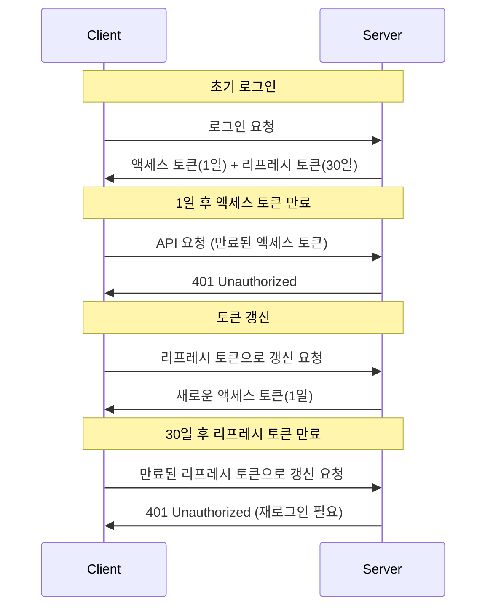

# 🔐 보안 설정 가이드

## 📅 JWT 리프레시 토큰 30일 설정 완료

### ✅ 변경 내용

JWT 리프레시 토큰의 유효기간을 **1일(86400000ms)**에서 **30일(2592000000ms)**로 변경했습니다.

```yaml
# 변경 전
JWT_REFRESH_TOKEN_VALIDITY=86400000     # 1일 (24시간)

# 변경 후
JWT_REFRESH_TOKEN_VALIDITY=2592000000   # 30일 (720시간)
```

### 📊 토큰 유효기간 정리

| 토큰 타입         | 유효기간 | 밀리초          | 용도             |
| ----------------- | -------- | --------------- | ---------------- |
| **액세스 토큰**   | 1일      | 86,400,000ms    | API 호출 인증    |
| **리프레시 토큰** | 30일     | 2,592,000,000ms | 액세스 토큰 갱신 |

### 🔄 토큰 갱신 플로우



---

## 🔑 JWT 시크릿 키 보안

### 🎯 JWT 시크릿 키란?

JWT 시크릿 키는 JWT 토큰의 **서명 생성 및 검증**에 사용되는 비밀 키입니다.

```java
// JwtTokenProvider.java에서 사용
@Value("${jwt.secret}")
private String secretKey;

// 토큰 생성 시
String token = Jwts.builder()
    .setSubject(username)
    .signWith(SignatureAlgorithm.HS256, secretKey)  // 시크릿 키로 서명
    .compact();

// 토큰 검증 시
Claims claims = Jwts.parser()
    .setSigningKey(secretKey)  // 시크릿 키로 검증
    .parseClaimsJws(token)
    .getBody();
```

### 🛡️ 시크릿 키 보안 요구사항

#### 1. **길이 요구사항**

- **최소 256비트 (32바이트)** 이상
- **권장: 512비트 (64바이트)**

#### 2. **복잡성 요구사항**

- 대소문자, 숫자, 특수문자 조합
- 예측 불가능한 랜덤 문자열
- 사전에 있는 단어 사용 금지

#### 3. **환경별 분리**

```bash
# 로컬 개발환경 (약한 키 - 개발용만)
JWT_SECRET=dev_secret_key_for_local_development_only_not_secure

# 개발서버 (중간 강도)
JWT_SECRET=dev_Kx9mP2nQ7wE5tY8uI3oP6aS9dF2gH5jK1lZ4xC7vB0nM3qW6eR9tY2uI5oP8aS1dF4gH7jK0lZ3xC6vB9nM2qW5eR8t

# 임시운영 (강한 키)
JWT_SECRET=staging_A7k9P3nQ2wE8tY5uI6oP1aS4dF7gH0jK3lZ9xC2vB5nM8qW1eR4tY7uI0oP3aS6dF9gH2jK5lZ8xC1vB4nM7qW0eR3t

# 운영환경 (최고 강도)
JWT_SECRET=prod_X9mP6nQ4wE2tY8uI1oP5aS9dF3gH7jK0lZ6xC4vB8nM2qW5eR9tY3uI7oP1aS4dF8gH2jK6lZ0xC5vB9nM3qW7eR1tY5uI8oP2aS6dF0gH4jK9lZ3xC7vB1nM5qW8eR2tY6uI0oP4aS8dF2gH6jK1lZ5xC9vB3nM7qW1eR5tY9uI3oP7aS1dF5gH9jK3lZ7xC1vB5nM9qW3eR7tY1uI5oP9aS3dF7gH1jK5lZ9xC3vB7nM1qW5eR9t
```

### 🔧 시크릿 키 생성 방법

#### 1. **OpenSSL 사용**

```bash
# 256비트 (32바이트) 키 생성
openssl rand -base64 32

# 512비트 (64바이트) 키 생성 (권장)
openssl rand -base64 64
```

#### 2. **Node.js 사용**

```javascript
const crypto = require("crypto");
// 256비트 키 생성
console.log(crypto.randomBytes(32).toString("base64"));
// 512비트 키 생성
console.log(crypto.randomBytes(64).toString("base64"));
```

#### 3. **Python 사용**

```python
import secrets
import base64

# 256비트 키 생성
key_256 = base64.b64encode(secrets.token_bytes(32)).decode('utf-8')
print(key_256)

# 512비트 키 생성
key_512 = base64.b64encode(secrets.token_bytes(64)).decode('utf-8')
print(key_512)
```

### 🚨 시크릿 키 보안 주의사항

#### ❌ 하지 말아야 할 것

- Git에 시크릿 키 커밋
- 로그에 시크릿 키 출력
- 클라이언트 코드에 시크릿 키 포함
- 약한 패스워드나 예측 가능한 문자열 사용

#### ✅ 해야 할 것

- 환경변수로만 관리
- 환경별로 다른 키 사용
- 정기적으로 키 교체 (6개월~1년)
- 안전한 키 저장소 사용 (AWS Secrets Manager, Azure Key Vault 등)

---

## 🔐 데이터베이스 비밀번호 암호화

### 🎯 현재 상황

현재 시스템에서는 **데이터베이스 비밀번호가 평문으로 저장**되어 있습니다:

```bash
# .env 파일
SPRING_DATASOURCE_PASSWORD=your_plain_text_password
```

### 🛡️ 암호화 방법 옵션

#### 1. **Jasypt를 이용한 암호화 (권장)**

##### 의존성 추가

```xml
<!-- pom.xml -->
<dependency>
    <groupId>com.github.ulisesbocchio</groupId>
    <artifactId>jasypt-spring-boot-starter</artifactId>
    <version>3.0.5</version>
</dependency>
```

##### 설정 추가

```yaml
# application.yml
jasypt:
  encryptor:
    password: ${JASYPT_ENCRYPTOR_PASSWORD}
    algorithm: PBEWITHHMACSHA512ANDAES_256
    iv-generator-classname: org.jasypt.iv.RandomIvGenerator
```

##### 비밀번호 암호화

```bash
# 암호화 도구 실행
java -cp jasypt-1.9.3.jar org.jasypt.intf.cli.JasyptPBEStringEncryptionCLI \
  input="your_db_password" \
  password="your_master_key" \
  algorithm=PBEWITHHMACSHA512ANDAES_256
```

##### 암호화된 비밀번호 사용

```bash
# .env 파일
JASYPT_ENCRYPTOR_PASSWORD=your_master_encryption_key
SPRING_DATASOURCE_PASSWORD=ENC(암호화된_비밀번호_문자열)
```

#### 2. **AWS Secrets Manager 사용**

##### 설정 추가

```xml
<!-- pom.xml -->
<dependency>
    <groupId>org.springframework.cloud</groupId>
    <artifactId>spring-cloud-starter-aws-secrets-manager-config</artifactId>
</dependency>
```

##### AWS Secrets Manager 설정

```yaml
# application.yml
aws:
  secretsmanager:
    name: arpina-db-credentials
    region: ap-northeast-2
```

##### 환경변수 설정

```bash
# .env 파일
AWS_ACCESS_KEY_ID=your_access_key
AWS_SECRET_ACCESS_KEY=your_secret_key
AWS_REGION=ap-northeast-2
```

#### 3. **Spring Cloud Config Server 사용**

##### Config Server 설정

```yaml
# config server의 application.yml
spring:
  cloud:
    config:
      server:
        encrypt:
          enabled: true
        git:
          uri: https://github.com/your-org/config-repo
```

##### 암호화된 설정 파일

```yaml
# config repo의 application-prod.yml
spring:
  datasource:
    password: "{cipher}암호화된_비밀번호_문자열"
```

### 🔧 Jasypt 구현 예시 (권장 방법)

#### 1. **JasyptConfig 클래스 생성**

```java
@Configuration
@EnableConfigurationProperties
public class JasyptConfig {

    @Bean("jasyptStringEncryptor")
    public StringEncryptor stringEncryptor() {
        PooledPBEStringEncryptor encryptor = new PooledPBEStringEncryptor();
        SimpleStringPBEConfig config = new SimpleStringPBEConfig();

        config.setPassword(getEncryptorPassword());
        config.setAlgorithm("PBEWITHHMACSHA512ANDAES_256");
        config.setIvGenerator(new RandomIvGenerator());
        config.setPoolSize(1);
        config.setSaltGenerator(new RandomSaltGenerator());
        config.setStringOutputType("base64");

        encryptor.setConfig(config);
        return encryptor;
    }

    private String getEncryptorPassword() {
        // 환경변수에서 마스터 키 가져오기
        String password = System.getenv("JASYPT_ENCRYPTOR_PASSWORD");
        if (password == null) {
            throw new IllegalStateException("JASYPT_ENCRYPTOR_PASSWORD environment variable is required");
        }
        return password;
    }
}
```

#### 2. **암호화 유틸리티 클래스**

```java
@Component
public class PasswordEncryptionUtil {

    private final StringEncryptor stringEncryptor;

    public PasswordEncryptionUtil(@Qualifier("jasyptStringEncryptor") StringEncryptor stringEncryptor) {
        this.stringEncryptor = stringEncryptor;
    }

    public String encrypt(String plainText) {
        return stringEncryptor.encrypt(plainText);
    }

    public String decrypt(String encryptedText) {
        return stringEncryptor.decrypt(encryptedText);
    }
}
```

#### 3. **환경별 설정**

```bash
# 로컬 개발환경
JASYPT_ENCRYPTOR_PASSWORD=local_master_key_for_development
SPRING_DATASOURCE_PASSWORD=ENC(로컬_DB_암호화된_비밀번호)

# 개발서버
JASYPT_ENCRYPTOR_PASSWORD=dev_master_key_very_secure
SPRING_DATASOURCE_PASSWORD=ENC(개발서버_DB_암호화된_비밀번호)

# 임시운영
JASYPT_ENCRYPTOR_PASSWORD=staging_master_key_extremely_secure
SPRING_DATASOURCE_PASSWORD=ENC(임시운영_DB_암호화된_비밀번호)

# 운영환경
JASYPT_ENCRYPTOR_PASSWORD=prod_master_key_maximum_security
SPRING_DATASOURCE_PASSWORD=ENC(운영_DB_암호화된_비밀번호)
```

### 🔄 마이그레이션 절차

#### 1. **준비 단계**

```bash
# 1. Jasypt 의존성 추가
# 2. JasyptConfig 클래스 생성
# 3. 마스터 키 생성
openssl rand -base64 32
```

#### 2. **암호화 단계**

```bash
# 각 환경별 DB 비밀번호 암호화
java -jar jasypt-cli.jar encrypt \
  input="actual_db_password" \
  password="master_encryption_key" \
  algorithm="PBEWITHHMACSHA512ANDAES_256"
```

#### 3. **배포 단계**

```bash
# 1. 새로운 .env 파일 생성 (암호화된 비밀번호 포함)
# 2. 서버에 마스터 키 환경변수 설정
# 3. 애플리케이션 재시작
# 4. 연결 테스트
```

### 🚨 암호화 보안 주의사항

#### ❌ 하지 말아야 할 것

- 마스터 키를 코드에 하드코딩
- 마스터 키를 Git에 커밋
- 모든 환경에서 같은 마스터 키 사용
- 암호화되지 않은 백업 파일 저장

#### ✅ 해야 할 것

- 마스터 키는 별도 보안 저장소에 관리
- 환경별로 다른 마스터 키 사용
- 정기적으로 비밀번호 및 마스터 키 교체
- 접근 권한 최소화 원칙 적용

---

## 📋 보안 체크리스트

### 🔐 JWT 보안

- [ ] 시크릿 키 512비트 이상 사용
- [ ] 환경별 다른 시크릿 키 적용
- [ ] 리프레시 토큰 30일 설정 완료
- [ ] 토큰 만료 시간 적절히 설정
- [ ] 시크릿 키 정기 교체 계획 수립

### 🔐 데이터베이스 보안

- [ ] DB 비밀번호 암호화 적용
- [ ] 마스터 키 안전한 저장소 관리
- [ ] 환경별 다른 DB 계정 사용
- [ ] DB 접근 권한 최소화
- [ ] 정기적인 비밀번호 변경

### 🔐 환경 보안

- [ ] .env 파일 Git 제외 설정
- [ ] 민감 정보 로그 출력 방지
- [ ] 운영환경 디버그 모드 비활성화
- [ ] CORS 설정 환경별 적절히 적용
- [ ] HTTPS 사용 (운영환경)

### 🔐 모니터링

- [ ] 로그인 실패 모니터링
- [ ] 비정상적인 토큰 사용 감지
- [ ] 데이터베이스 접근 로그 모니터링
- [ ] 보안 이벤트 알림 설정

---

## 🆘 문제 해결

### 🔧 JWT 관련 문제

#### 문제: "JWT signature does not match locally computed signature"

**원인**: 잘못된 시크릿 키 사용
**해결**:

```bash
# 시크릿 키 확인
echo $JWT_SECRET
# 환경변수 재설정
export JWT_SECRET=올바른_시크릿_키
```

#### 문제: 토큰이 너무 자주 만료됨

**원인**: 액세스 토큰 유효시간이 너무 짧음
**해결**:

```bash
# 액세스 토큰 유효시간 연장 (1일 → 2일)
JWT_ACCESS_TOKEN_VALIDITY=172800000
```

### 🔧 DB 암호화 관련 문제

#### 문제: "Unable to decrypt property"

**원인**: 잘못된 마스터 키 또는 암호화 알고리즘
**해결**:

```bash
# 마스터 키 확인
echo $JASYPT_ENCRYPTOR_PASSWORD
# 복호화 테스트
java -jar jasypt-cli.jar decrypt input="ENC(...)" password="마스터_키"
```

#### 문제: 데이터베이스 연결 실패

**원인**: 암호화된 비밀번호 복호화 실패
**해결**:

```bash
# 평문 비밀번호로 임시 테스트
SPRING_DATASOURCE_PASSWORD=평문_비밀번호
# 연결 확인 후 다시 암호화 적용
```

이제 JWT 리프레시 토큰이 30일로 설정되었고, 보안 관련 모든 요소들에 대한 상세한 가이드가 완성되었습니다.
